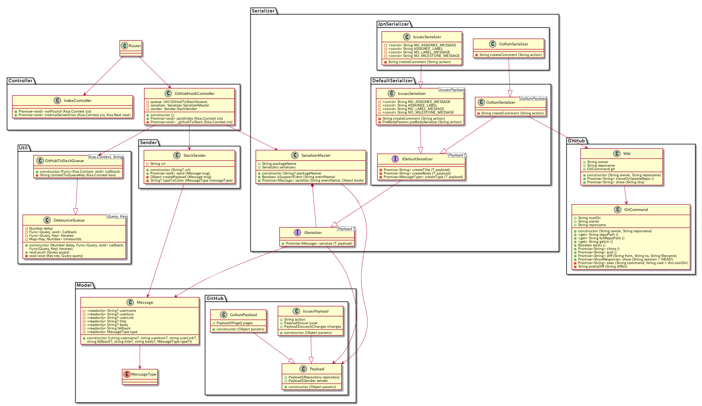

# github2slack

[](https://travis-ci.org/snakazawa/github2slack)
[](https://codeclimate.com/github/snakazawa/github2slack)
[](https://gemnasium.com/github.com/snakazawa/github2slack)

Simply and customizable GitHub-Slack notifier. 

GitHubの通知をSlackに飛ばす通知システムです。  
シンプルかつカスタマイズ性が高いのが特徴です。


## Serializer Packages

### DefaultSerializer

Simple English serializer

Support events:

- [x] IssuesEvent
- [x] IssueCommentEvent
- [x] GollumEvent
- [ ] CommitCommentEvent
- [ ] PushEvent
- [ ] CreateEvent
- [ ] DeleteEvent
- [ ] LabelEvent
- [ ] MilestoneEvent
- [x] ProjectCardEvent
- [x] ProjectColumnEvent
- [x] ProjectEvent
- [ ] PullRequestEvent
- [ ] PullRequestReviewEvent
- [ ] PullRequestReviewCommentEvent


### JpnSerializer

Japanese serializer

Support events:

- [x] IssuesEvent
- [x] IssueCommentEvent
- [x] GollumEvent
- [ ] CommitCommentEvent
- [ ] PushEvent
- [ ] CreateEvent
- [ ] DeleteEvent
- [ ] LabelEvent
- [ ] MilestoneEvent
- [x] ProjectCardEvent
- [x] ProjectColumnEvent
- [x] ProjectEvent
- [ ] PullRequestEvent
- [ ] PullRequestReviewEvent
- [ ] PullRequestReviewCommentEvent


## Requirements

- Node.js: ~8.1.2
- Git (and authenticated user)


## Install

```bash
cp .env.default .env
# Edit .env (See Environment section on README)

npm install
npm run build
```

DefaultSerializer、JpnSerializer、またはそれらを継承したパッケージを使う場合は、実行するユーザーが git コマンドにより、連携する GitHub リポジトリにアクセスできるよう設定する必要があります。  
他に、SlackのIncoming WebhooksのURIと、GitHubのアクセストークンを.envで指定してください。


## Serve

`npm run start` で開始できます。  
永続化する場合は、PM2などを利用してください（ `dotenv/config` をプリロードすることを忘れないでください）。


## Environment

.env を使って環境変数を設定できます。

- NAME: アプリケーション名です。デフォルトは"slack2github"です。
- SLACKBOT_URI: **(必須)** あなたのチームの Slack Incomming Webhooks の URIを指定してください。
- SERIALIZER: 使用するSerializerを指定します。 
[Serializer Packages](#Serializer%20Packages)に記載されているパッケージ名か、自作パッケージ名を指定してください。
デフォルトは[DefaultSerializer](#DefaultSerializer)です。
- TIME_ZONE: タイムゾーンです。
- TOKEN: **(必須)** GitHubのAccess Tokenです（参考: [Creating a personal access token for the command line \- User Documentation](https://help.github.com/articles/creating-a-personal-access-token-for-the-command-line/)。
- QUEUE_DEBOUNCE_DELAY: Webhookが来てからそれを処理するまでのディレイ時間を指定できます(ms)。 
時間内の似たようなイベントは、Util.GitHubToSlackQueueによってまとめられます。
デフォルトは500ミリ秒です。
- PORT: Webサーバーのポート番号です。デフォルトは3000です。


## Development

### npm scripts

- `npm run start`: アプリケーションを起動します。
- `npm run lint <file>`: 指定したファイルに対して ESLint を実行します。
- `npm run lint:all`: すべてのファイルに対して ESLint を実行します。
- `npm run flow`: Flow を実行します。デフォルトでは、すべてのファイルに対して型チェックを行います。
- `npm run build`: Webpack によるビルドを行います。
- `npm run watch`: Webpack によるファイル監視を行います。
- `npm run check`: すべてのファイルに対して ESLint と Flow による型チェックを行います。
- `npm run gen:package -- --name <name>` 新しいSerializerパッケージを作成します。

### Directory structure

すべてのソースファイルは `src/` に配置します。  
[Class Diagram](#Class%20Diagram) も参照してください。

- `src/controller/`: HTTPリクエストを処理するコントローラーを配置します。
- `src/model/`: MessageやPayloadなどのデータ定義を配置します。
- `src/sender/`: 通知処理クラスを配置します
- `src/serializer/`: イベントをMessageに変換するクラスを配置します。
- `src/github/`: GitHubとの通信やGitコマンドを扱うクラスを配置します。
- `src/util/`: 便利クラスを配置します。
- `src/router.js`: ルーティング行うクラスです。
- `src/app.js`: Webサーバークラスです。
- `src/www.js`: Webサーバーを起動するファイルです。

### Create new serializer package

テンプレートとコマンドを利用して新しい自作Serializerパッケージを作成することができます。  
自作Serializerパッケージを作ることで、多言語対応や、好きなキャラクターのBOT、細かなカスタマイズが可能です。

例として、 `HogeSerializer` パッケージの作成手順は、以下のようになります。

- `npm run gen:package -- --name HogeSerializer` を実行し、テンプレートを作成する。
- `.env` の SERIALIZER 変数を "HogeSerializer" に変更する。
- `src/serializer/HogeSerializer/index.js` を編集し、無効にするイベントを削除する。
- `src/serializer/HogeSerializer/issues_serializer` などを好きなように編集する。
- `npm run check` により ESLint と Flow を実行し、エラー箇所があれば修正する。
- `npm run build` を実行し、ビルドファイルを生成する。
- `npm run start` などでWebサーバーを立ち上げる。

### Class Diagram


